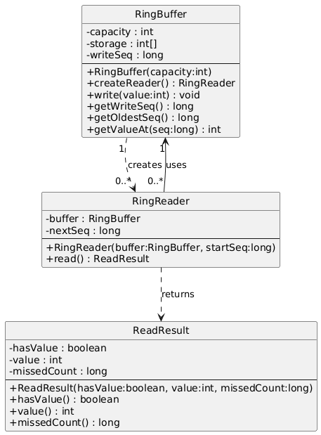
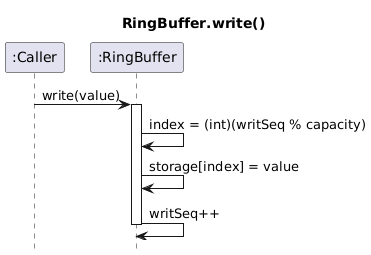
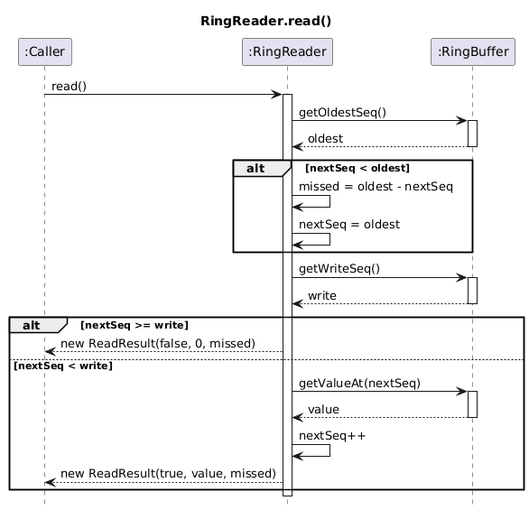

# Ring Buffer (Single Writer, Multiple Readers)

## Overview

This project implements a fixed-capacity **Ring Buffer** that supports:

* A single writer
* Multiple independent readers
* Overwriting of the oldest data when the buffer becomes full
* Detection of missed items for slow readers

The solution is designed using proper object-oriented principles with clear separation of responsibilities between classes.

---

## System Design

The implementation consists of three main classes:

---

### RingBuffer

**Responsibility:**

* Stores data in a fixed-size circular array
* Maintains the global write sequence (`writeSeq`)
* Calculates the oldest available sequence
* Handles overwrite behavior when the buffer becomes full

**Key Fields:**

* `capacity` – fixed size of the buffer
* `storage[]` – internal array storing values
* `writeSeq` – total number of values written

When the buffer becomes full, new values overwrite the oldest values using modulo indexing:

```
index = writeSeq % capacity
```

---

### RingReader

**Responsibility:**

* Maintains its own reading position (`nextSeq`)
* Reads values independently from other readers
* Detects when items were missed due to overwriting

Each reader:

* Has its own reading sequence
* Does not remove data from the buffer
* May miss values if it falls behind the writer

If a reader’s `nextSeq` is smaller than the buffer’s `oldestSeq`, it means the reader has missed some items. The reader:

* Calculates the number of missed items
* Moves its position to the oldest available sequence
* Continues reading from there

---

### ReadResult

**Responsibility:**
Encapsulates the result of a read operation.

It contains:

* `hasValue` – indicates if a value was successfully read
* `value` – the value read (if available)
* `missedCount` – number of items missed due to overwriting

This avoids using special return values (such as `-1`) and keeps the API clean and expressive.

---

## Overwrite Behavior

The buffer keeps only the last **N** values.

When:

```
writeSeq > capacity
```

The oldest available sequence becomes:

```
oldestSeq = writeSeq - capacity
```

If a reader’s `nextSeq` is less than `oldestSeq`, the reader has missed items and will skip forward.

---

## Example Scenario

Capacity = 3
Values written: 1, 2, 3, 4, 5

Final buffer content:

```
3, 4, 5
```

If a reader has not read any values before these writes:

* It will miss values 1 and 2
* Its first read will return value 3
* `missedCount = 2`

---

## UML Class Diagram


---

## UML Sequence Diagram – write()



---

## UML Sequence Diagram – read()



---

## How to Run

1. Open the project in your IDE.
2. Run the `RingBufferDemo` class.
3. The demo includes:

   * Empty read test
   * Independent multiple readers test
   * Overwrite and missed items test

---

## Object-Oriented Design Principles

* Clear separation of responsibilities
* Encapsulation of internal state
* Independent reader behavior
* Clean class structure without combining all logic in one class
* Use of a value object (`ReadResult`) instead of primitive return codes

